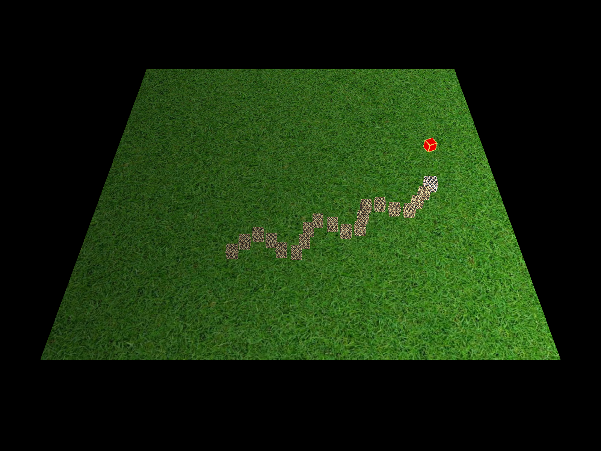

# 3D贪吃蛇小游戏

哈工大2024春《图形学与虚拟现实》课程大作业，使用Python和Pygame开发
<div style="display: flex; justify-content: space-around;">
  
  
  
</div>

## 文件结构

- `main.py`：主程序文件，负责游戏的初始化和主循环
- `snake.py`：定义贪吃蛇类，包含贪吃蛇的移动、增长和碰撞检测等功能
- `food.py`：定义食物类，包含食物的位置和重生功能
- `environment.py`：包含绘制平面和立方体的函数，负责游戏环境的绘制
- `utils.py`：包括游戏菜单在内的功能函数

## 依赖安装

在运行游戏之前，请确保已安装以下依赖：

```bash
pip install pygame PyOpenGL numpy
```

## 运行游戏

使用以下命令行运行游戏：

```bash
python main.py
```

## 游戏控制
> 注意：如果按键失效，请尝试将输入法切换至英文

| 命令 | 按键 |
| ------- | :-: |
| 开始游戏 | S |
| 重新游戏 | R |
| 退出游戏 | Q |
| 暂停 / 继续游戏 | P |
| 逆时针旋转 | Left |
| 顺时针旋转 | Right |
| Roll left | Left |
| Roll right| Right |


## TODO

- [x] 添加环境光照
- [x] 为平面添加纹理
- [x] 修复立方体bug：调整立方体6个面的排序
- [x] 添加边界
- [x] 为蛇添加纹理
- [x] 添加主界面、暂停、开始
- [x] 食物旋转
  - [x] 修复食物旋转bug
- [x] 增加蛇的间隔
  - [x] 修复增加间隔后的闪烁bug
- [ ] 旋转光照
- [ ] 摄像机视角控制
